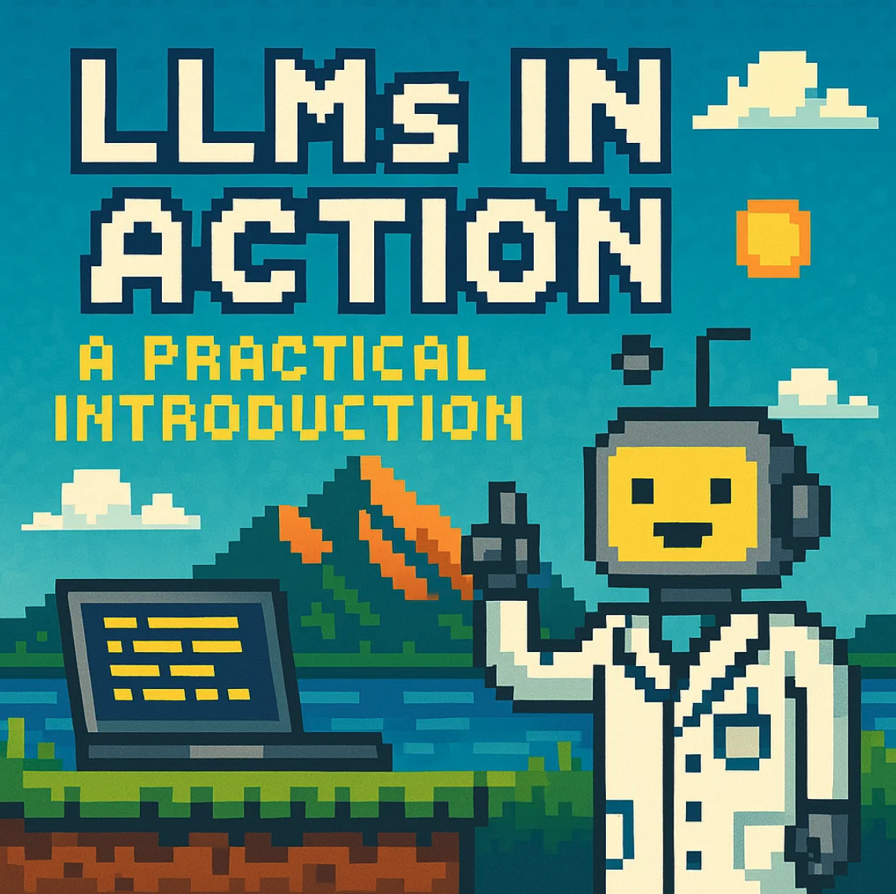

# LLMs In Action Nanocourse 2025 (Student Materials) 🤖🧠

## 📑 Table of Contents
- [Overview](#this-repo-will-store-the-materials-related-to-the-april-2025-nanocourse-for-instructors)
- [Syllabi & Materials](#syllabi--materials)
- [Course Overview](#course-overview)
- [Course Description](#course-description)
- [Instructional Guidance](#additional-preparation-and-instructional-guidance)
- [Git Submodules](#git-submodules)

## Resources related to the **October 2025 nanocourse** for [***students***].

> **Note:** The Spring 2025 (April) version of this course has been tagged as `spring2025` for reference.

* In this repo, students can find course lectures, labs/exercises, and other resources. Each section has a subdirectory.
* This github repo will primarily provide access to markdown-code-based exercise/demo worksheets for ease of use.

* Additional materials will also be provided via the course MS Teams page.
  * 🔗 Teams page will be created closer to the course date
  * Class Files/documents will be shared to the Teams page when ready for sharing.

## Syllabi & Materials 📚

### October 2025 Course Materials

- Syllabus will be shared via Teams closer to the course date

### Spring 2025 Course Materials (Historical Reference)

- Syllabus from Spring 2025 course:
  - 📄 <a href="https://365utsouthwestern.sharepoint.com/:w:/r/sites/LLMsinActionAPracticalIntroduction-Nanocourse2025/Shared%20Documents/General/Syllabus_LLMs_In_Action_Nano2025_share.docx?d=w72bc983678d549909eee4ae19a06e9c4&csf=1&web=1&e=cK4mxN" target="_blank">**Spring 2025 Shared Syllabus**</a>

A snapshot is provided below:

## LLMs in Action: A Practical Introduction

### Course Overview

- **Title:** LLMs in Action: A Practical Introduction
- **Dates:** October 27-28, 2025 (Monday-Tuesday)
- **Time:** 9:00 AM - 5:00 PM both days
- **Location:** G9.102
- **Instructors:**
  - Andrew R. Jamieson, PhD (Course Director)
  - Michael Holcomb, MS
  - David Hein, MS
  - Ameer Shakur, PhD
  - Shinyoung Kang, MS
  - Tra Ngo, PhD (TA)

---

### Course Description

This two-day nanocourse introduces Large Language Models (LLMs) to a diverse biomedical audience—faculty, staff, post-docs, students, and MDs—with no prior programming required. Using accessible platforms like Google AI Studio, participants will explore LLM fundamentals, healthcare applications, ethical challenges, and practical skills through hands-on labs. The course aims to empower attendees to responsibly apply LLMs in their work, emphasizing real-world insights and basic tool usage.

---

### Target Audience

Faculty, staff, post-docs, graduate students, and MDs with varying levels of experience with LLMs. No programming background is required, though basic computer literacy is expected.

---

### Learning Objectives

By the end of this course, participants will be able to:
- Understand the fundamental concepts of LLMs and their potential impact on healthcare.
- Create effective prompts for specific healthcare and research tasks.
- Identify and mitigate hallucinations in LLM outputs.
- Compare different LLM platforms and their capabilities.
- Apply ethical considerations when using LLMs in healthcare contexts.
- Design basic workflows incorporating LLMs for biomedical applications.
- Convert raw text to structured data using appropriate prompting techniques.
- Recognize differences between standard and advanced models (including reasoning models and multimodal capabilities).
- Understand the concepts behind tool use, Retrieval-Augmented Generation (RAG), multimodal inputs (image, voice), and agentic systems.

---

### Prerequisites

- Laptop with internet connectivity.
- Google account (for Google AI Studio).
- Basic computer literacy.
- No programming experience required, though exposure to machine learning concepts is helpful.

---

## Day 1: Foundations, Prompting, and Healthcare Applications

### Morning Session (9:00 AM - 12:00 PM)

- **9:00 AM - 9:30 AM: Welcome & Introduction [Andrew + All]**
  - Instructor introductions and course overview.
  - Background assessment: Experience levels and expectations.
  - Setting expectations: No coding required, focus on practical applications.

- **9:30 AM - 10:30 AM: Lecture 1 – LLM Fundamentals [Instructor: Andrew]**
  - What are foundation models and LLMs?
  - Basic concepts: tokens, context windows, temperature.
  - Brief historical development of LLMs.
  - Common misconceptions (non-deterministic nature, limitations).
  - Brief overview of extended capabilities (multimodal, agents).

- **10:30 AM - 10:45 AM: Break**

- **10:45 AM - 11:15 AM: Hands-On Lab 1 – Getting Started with LLMs - "Hello World" [Andrew]**
  - Tour of top consumer-grade platforms ([ChatGPT](https://chat.openai.com/), [Claude](https://claude.ai/), [Grok](https://grok.x.ai/), [Microsoft Copilot](https://copilot.microsoft.com/)).
  - Introduction to specialized tools like [NotebookLM](https://notebooklm.google.com/) for research.
  - Overview of local models with [LM Studio](https://lmstudio.ai/) for privacy.
  - Tour of developer tools like code editors ([Cursor](https://cursor.sh/)) and CLIs ([Claude Code](https://claude.ai/code), [Gemini CLI](https://github.com/google/gemini-cli)).
  - Account setup and basic interface orientation for Google AI Studio.
  - First prompts and observations of variability.
  - Introduction to [Google AI Studio](https://aistudio.google.com/) as the primary course platform.

- **11:15 AM - 12:00 PM: Lecture 2a/Demo – Prompt Engineering Basics (Part 1) [Ameer]**
  - Crafting effective prompts: clarity, context, specificity.
  - Basic prompting techniques: zero-shot, few-shot learning.
  - Live demonstrations of prompt improvement.
  - Example prompts for biomedical tasks.

### Lunch Break (12:00 PM - 1:00 PM)

### Afternoon Session (1:00 PM - 5:00 PM)

- **1:00 PM - 1:30 PM: Lecture 2b/Demo – Prompt Engineering Basics (Part 2) [Ameer]**
  - Advanced prompting techniques: chain-of-thought, self-verification.
  - Role prompting and setting expectations.
  - Managing context limitations effectively.
  - Common pitfalls and how to avoid them.

- **1:30 PM - 2:30 PM: Hands-On Lab 2 – Prompt Practice [Ameer]**
  - Scenario-based exercises with clinical and biomedical texts.
  - Iterative prompt improvement and refinement.
  - Experimenting with different prompting techniques.
  - Group sharing of effective strategies.

- **2:30 PM - 2:45 PM: Break**

- **2:45 PM - 3:30 PM: Lecture 3a – Biomedical Science/Healthcare Applications [Dave]**
  - Survey of healthcare and biomedical applications.
  - Examples from literature (JAMA studies on LLMs in diagnosis).
  - Case studies of implemented systems (AMIE, etc.).
  - Research and practical applications in healthcare.

- **3:30 PM - 4:00 PM: Lecture 3b – Ethical Challenges [Dave]**
  - Hallucinations and their risks in healthcare.
  - Privacy, HIPAA, and data security concerns.
  - Societal impacts of content scraping and intellectual property.
  - Data residency issues and institutional considerations.
  - Responsible use frameworks for healthcare.

- **4:00 PM - 4:30 PM: Hands-On Lab 3 – Spotting Issues [Dave]**
  - Testing for hallucinations and inconsistencies.
  - Comparing model outputs for accuracy.
  - Practicing verification techniques.
  - Evaluating ethical implications in real scenarios.

- **4:30 PM - 5:00 PM: Group Discussion & Day 1 Wrap-up [All instructors]**
  - Sharing insights from labs.
  - Discussing applications in participants' work.
  - Preview of Day 2 content.

---

## Day 2: Structured Data, Advanced Capabilities, and Applications

### Morning Session (9:00 AM - 12:00 PM)

- **9:00 AM - 9:15 AM: Day 2 Welcome & Q&A [Andrew + All]**
  - Recap of Day 1 key concepts.
  - Addressing overnight questions.
  - Setting expectations for Day 2.

- **9:15 AM - 10:00 AM: Lecture/Demo – Structured Outputs & Data Extraction [Instructor: Dave]**
  - Converting unstructured text to structured formats (JSON, tables).
  - Techniques for consistent data extraction from clinical texts.
  - Using structured output tools in Google AI Studio.
  - Healthcare applications: patient data, clinical variables.
  - Demonstration of format specification and validation.

- **10:00 AM - 10:45 AM: Hands-On Lab – Structured Output Practice [Dave]**
  - Extracting structured data from clinical notes.
  - Testing format specification techniques.
  - Comparing output consistency across formats.
  - Building reusable structured output templates.

- **10:45 AM - 11:00 AM: Break**

- **11:00 AM - 11:30 AM: Lecture – Multimodal LLMs [Ameer]**
  - Introduction to multimodal capabilities (text + image, audio, video).
  - Visual reasoning and understanding.
  - Voice interaction and audio analysis.
  - Medical imaging applications.
  - Limitations and verification needs.
  - Demonstrations with biomedical examples.

- **11:30 AM - 12:00 PM: Lab – Multimodal [Shin]**
  - Neurological examination video analysis demonstrations.

### Lunch Break (12:00 PM - 1:00 PM)

### Afternoon Session (1:00 PM - 5:00 PM)

- **1:00 PM - 1:30 PM: Lecture – Tool Use with LLMs [Mike]**
  - Tool-using capabilities of modern LLMs.
  - Code execution capabilities.
  - Experimenting with code generation for data analysis.

- **1:30 PM - 2:00 PM: Lab – Tool Use with LLMs: Healthcare Calculators [Mike/All]**
  - Zero-shot generation.
  - Function calling (structured output vs native function calling).
  - Code execution.

- **2:15 PM - 3:15 PM: Lecture – RAG with LLMs [Mike]**
  - Introduction to Retrieval-Augmented Generation (RAG).
  - Bayesian formulation.
  - Challenges/Limitations.

  **Lab – RAG with LLMs: Patient Education Materials [Mike]**
  - Vanilla generation.
  - Manual context injection.
  - Grounding with web search.

- **3:15 PM - 3:30 PM: Break**

- **3:30 PM - 4:30 PM: Lecture/Demo – Introduction to Agents [Mike]**
  - The spectrum of agent capabilities.
  - Looping, self-planning, workflow management.
  - Operator/Claude/open source demonstrations.
  - Future directions in healthcare agent systems.
  - From tools to autonomous workflows.

- **4:30 PM - 5:00 PM: Course Wrap-up & Next Steps [ALL instructors]**
  - Key takeaways from both days.
  - Resources for continued learning.
  - Discussion of implementation in participants' work.
  - Course evaluation.
  - Final Q&A.

---

## Implementation Notes

### Primary Platforms

- Google AI Studio (primary – free, accessible)
- LM Studio (for demonstration)

### Teaching Approach

- Focus on hands-on, practical applications.
- Emphasize ethical considerations throughout.
- Provide ample time for experimentation and discussion.
- Keep technical content accessible to non-programmers.
- Highlight real-world healthcare applications.

### Important Institutional Notes

- ⚠️ Remind participants about data security requirements.
- 🔒 Emphasize not to upload sensitive/protected data to public LLM platforms.
- 📋 Note institutional policies regarding acceptable LLM usage.
- 🏛️ Inform about Executive Order limitations on certain platforms (e.g., DeepSeek).

---

Developed with ❤️ for the UTSW Community | 2025

